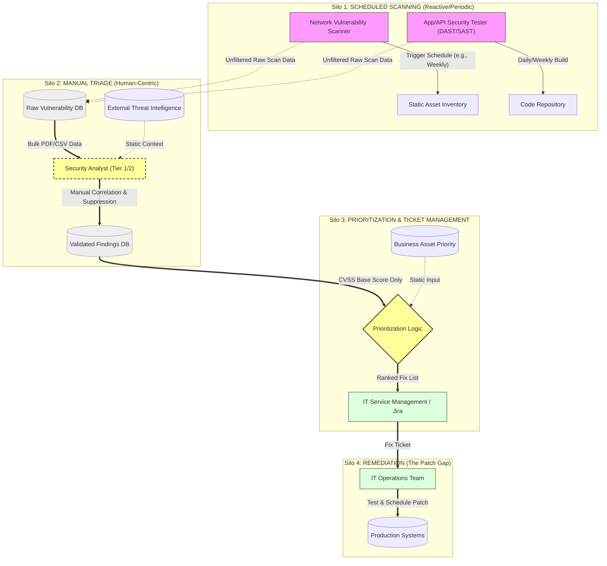
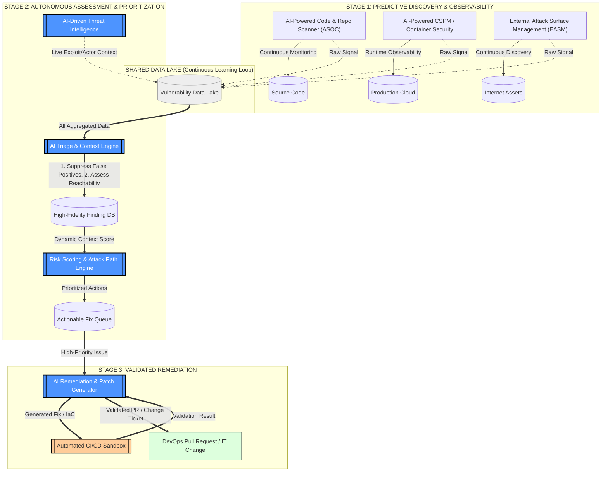

# Vulnerability Architecture Pre and Post-AI

## Pre-AI Architecture

```mermaid
graph TD
    %% Define Nodes and Layers
    subgraph "Silo 1: SCHEDULED SCANNING (Reactive/Periodic)"
        ScannerA[Network Vulnerability Scanner] -->|"Trigger Schedule (e.g., Weekly)"| AssetDB[Static Asset Inventory]
        ScannerB["App/API Security Tester (DAST/SAST)"] -->|"Daily/Weekly Build"| SourceCode[Code Repository]
    end

    subgraph "Silo 2: MANUAL TRIAGE (Human-Centric)"
        ScannerA -.->|"Unfiltered Raw Scan Data"| ReportDB[(Raw Vulnerability DB)]
        ScannerB -.->|"Unfiltered Raw Scan Data"| ReportDB

        ReportDB ==>|"Bulk PDF/CSV Data"| AnalystTriage["Security Analyst (Tier 1/2)"]
        AnalystTriage ==>|"Manual Correlation & Suppression"| ValidatedFindings[(Validated Findings DB)]
        RiskDB[(External Threat Intelligence)] -.->|"Static Context"| AnalystTriage
    end

    subgraph "Silo 3: PRIORITIZATION & TICKET MANAGEMENT"
        ValidatedFindings ==>|"CVSS Base Score Only"| PrioritizationEngine{Prioritization Logic}
        BusinessDB[(Business Asset Priority)] -.->|"Static Input"| PrioritizationEngine
        PrioritizationEngine ==>|"Ranked Fix List"| TicketSystem[IT Service Management / Jira]
    end

    subgraph "Silo 4: REMEDIATION (The Patch Gap)"
        TicketSystem ==>|"Fix Ticket"| ITOps[IT Operations Team]
        ITOps ==>|"Test & Schedule Patch"| ProductionSys[(Production Systems)]
    end

    %% Apply Styles
    style ScannerA fill:#f9f,stroke:#333,stroke-width:1px
    style ScannerB fill:#f9f,stroke:#333,stroke-width:1px
    style ReportDB fill:#eee,stroke:#999,stroke-width:1px
    style ValidatedFindings fill:#eee,stroke:#999,stroke-width:1px
    style AnalystTriage fill:#ff9,stroke:#333,stroke-width:2px,stroke-dasharray: 5 5
    style PrioritizationEngine fill:#ff9,stroke:#333,stroke-width:2px
    style TicketSystem fill:#dfd,stroke:#333,stroke-width:1px
    style ITOps fill:#dfd,stroke:#333,stroke-width:1px
```

## Post-AI Architecture

```mermaid
graph TD
    %% Define Nodes and Layers
    subgraph "SHARED DATA LAKE (Continuous Learning Loop)"
        VulnData[(Vulnerability Data Lake)]
    end

    subgraph "STAGE 1: PREDICTIVE DISCOVERY & OBSERVABILITY"
        CodeAI["AI-Powered Code & Repo Scanner (ASOC)"] -->|"Continuous Monitoring"| GitRepo[(Source Code)]
        InfraAI["AI-Powered CSPM / Container Security"] -->|"Runtime Observability"| CloudInfra[(Production Cloud)]
        AttackSurfaceAI["External Attack Surface Management (EASM)"] -->|"Continuous Discovery"| ExternalAssets[(Internet Assets)]
    end

    subgraph "STAGE 2: AUTONOMOUS ASSESSMENT & PRIORITIZATION"
        TriageAI[[AI Triage & Context Engine]]:::aiNode
        ThreatIntel[[AI-Driven Threat Intelligence]]:::aiNode

        CodeAI -.->|"Raw Signal"| VulnData
        InfraAI -.->|"Raw Signal"| VulnData
        AttackSurfaceAI -.->|"Raw Signal"| VulnData
        ThreatIntel -.->|"Live Exploit/Actor Context"| VulnData

        VulnData ==>|"All Aggregated Data"| TriageAI
        TriageAI ==>|"1. Suppress False Positives, 2. Assess Reachability"| ValidatedFindingsAI[(High-Fidelity Finding DB)]

        ValidatedFindingsAI ==>|"Dynamic Context Score"| RiskEngine[[Risk Scoring & Attack Path Engine]]:::aiNode
        RiskEngine ==>|"Prioritized Actions"| ActionQueue[(Actionable Fix Queue)]
    end

    subgraph "STAGE 3: VALIDATED REMEDIATION"
        ActionQueue ==>|"High-Priority Issue"| FixGenerator[[AI Remediation & Patch Generator]]:::aiNode
        FixGenerator ==>|"Generated Fix / IaC"| ValidationSandbox[[Automated CI/CD Sandbox]]:::sandboxNode
        ValidationSandbox ==>|"Validation Result"| FixGenerator
        FixGenerator ==>|"Validated PR / Change Ticket"| DevOpsPR[DevOps Pull Request / IT Change]
    end

    %% Apply Styles
    classDef aiNode fill:#4d94ff,stroke:#000,stroke-width:2px,color:#fff;
    classDef sandboxNode fill:#ffcc99,stroke:#000,stroke-width:2px;

    style VulnData fill:#eee,stroke:#999,stroke-width:1px
    style TriageAI fill:#4d94ff,stroke:#000,stroke-width:2px,color:#fff;
    style ThreatIntel fill:#4d94ff,stroke:#000,stroke-width:2px,color:#fff;
    style RiskEngine fill:#4d94ff,stroke:#000,stroke-width:2px,color:#fff;
    style FixGenerator fill:#4d94ff,stroke:#000,stroke-width:2px,color:#fff;
    style ValidationSandbox fill:#ffcc99,stroke:#000,stroke-width:2px;
    style DevOpsPR fill:#dfd,stroke:#333,stroke-width:1px;
```
